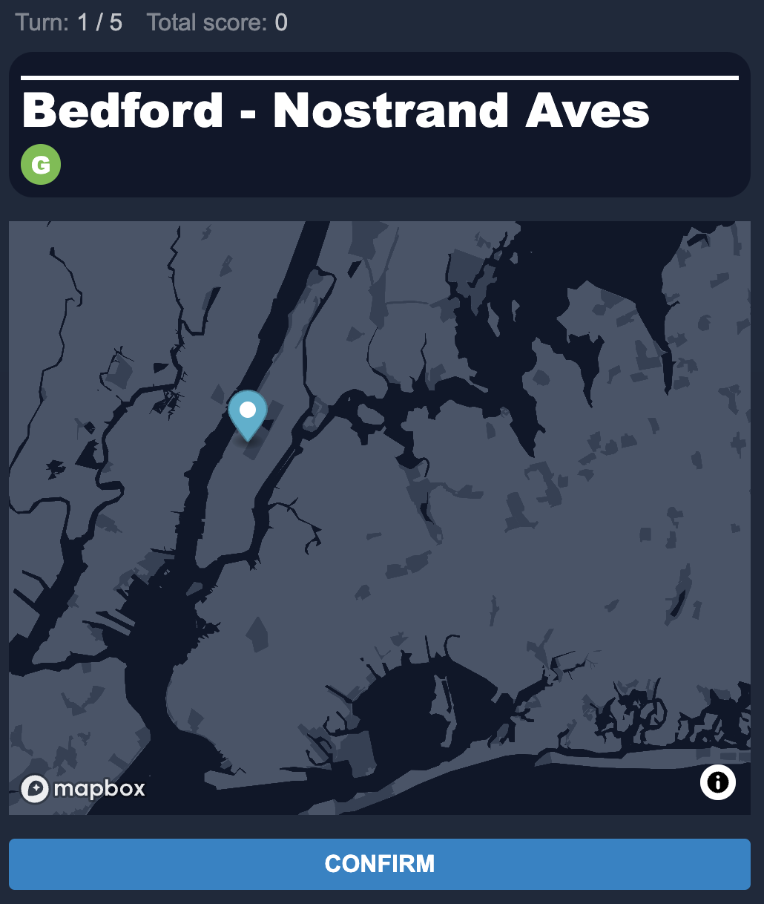

# Transit Guessr

Transit Guessr is a GeoGuessr-style game for subway systems.

It was initiall just NYC, but has been refactored to support multiple subway
systems (currently Boston is the only other system, but more are on the way.)

There are essentially two apps running in this repo:

1. The Transit Guessr game
2. The analysis UI at `/data`: a visualization of 1 week of collected guess
   data. The data is no longer collected since it costs money to store and
   query, so it's just a one-time thing

## Data

All station data is just manually created as a JSON file. For NYC I used [NYC Open
Data](https://data.cityofnewyork.us/Transportation/Subway-Stations/arq3-7z49).
For Boston, I used the publicly-available data and had the help of twitter user
[@2urbaneric1](https://twitter.com/2urbaneric1) to get the data into the correct
format. That data is stored
[here](https://docs.google.com/spreadsheets/d/1bxJ7ftl-Ia0HmFglvWSOCL6lmtRHtANxBw3VgcCVrco/edit?usp=sharing)

This is not an ideal data pipeline, but any sort of automated system felt like
overkill.

For the analysis data, guess + final score info was pushed to firebase. That
data was then aggregated with a bigquery query to generate
`src/data/guesses.tsx`. An additional script was used to generate `.geojson`
files from the firebase data for each individual station.

Again, this was not ideal and would require an annoying amount of manual effort
to do again, but I don't really intend to do this specific analysis in an
ongoing manner.

## Development

This project was bootstrapped with [Create React App](https://github.com/facebook/create-react-app).

You should be able to run it with `npm run start`

To run, you will need to create a Mapbox API token following [these
instructions](https://docs.mapbox.com/help/tutorials/get-started-tokens-api/).
After creating, copy `.env.local.example` to `.env.local` and then have `REACT_APP_MAPBOX_TOKEN` map
to your new token.

There are no tests, just manual testing.

The transit operator that the game is played with is controlled using the
`REACT_APP_TRANSITGUESSR_OPERATOR` env var. Current valid values are `mta` and
`mbta'

## Contributing

Feel free to contibute any change! If you feel like making a contribution, some
things I want to add are:

1. Different "levels" (hard = no parks, easy = shows streets)
2. More transit lines (Staten Island, LIRR, etc.)
3. Perhaps different transit agencies!
4. Any sorts of CSS or react improvments. These aren't my area of expertise so
   lots of the code here is pretty bad
